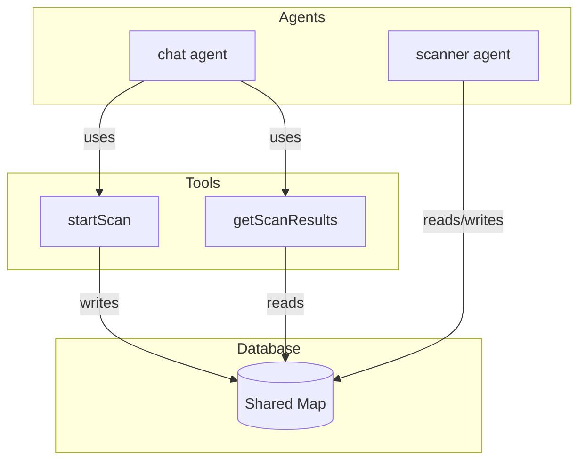
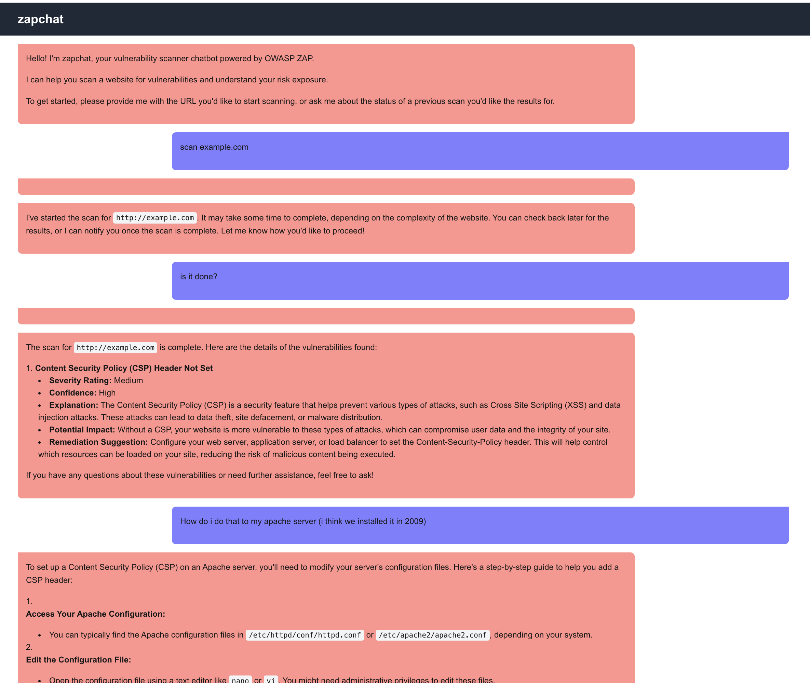

# zapchat

zapchat is a chatbot that uses ZAP to scan your code and find vulnerabilities. It's built with Next.js and uses the OpenAI API to generate responses.

# Setup

1. Copy `.env.template` to `.env` and set the environment variables.
2. Run `npm install` to install the dependencies.
3. Run `docker compose up` to start the zap container.
4. Run `npm run dev` to start the development server.
5. Open [http://localhost:3000](http://localhost:3000) to interact with the chatbot. An example input is provided in the app.

# Architecture & Limitations

This is a standard Next.js monolith. Due to time limitations, all logic is synchronously executed within the request-response cycle, rather than suitably architected to support running scans asynchronously and pushing updates back to the client. This also means that the user must prompt for status updates to drive the process forward. The LLM orchestrates all the tool calls to demonstrate tool calling, but it would be abstracted behind one or two tools.

The central data model is `ChatCompletionMessageParam` from OpenAI SDK, which significantly simplifies the implementation. However, it doesn't have a timestamp and is persisted to cookies, which is evidentally flakey and can affect the messages fed to the LLM and subsequent quality of results.

## Other Assumptions

- Currently ranking "top" alerts by risk then confidence.
- Codebase has been annotated with TODOs containing assumptions/limitations.

# Production

This app is publicly accessible at https://zapchat-production.up.railway.app/.

# Agents

We have two agents. These agents have different lifecycles and therefore communicate over a shared "database" (local `Map`), rather than using a "Multi-Agent Collaboration" pattern. As such, the `chat` agent uses tools to interact with the `scanner` agent via the database.

1. `chat` - brokers interactions with the user, including enquiring about the status of a scan. The agent is short-running, ensuring that the user can interact with the chatbot immediately.

- Tools
  - `startScan` - starts a new scan on a given URL.
  - `getScanResults` - checks the status of a scan or the results of a completed scan.

2. `scanner` - orchestrates the scanning process, including scheduling the spider and active scans, polling their status, and obtaining the results. The agent is long-running, and lives beyond the lifecycle of `chat`. The `scanner` agent is deterministic logic given there is no need for reasoning and this competency has already been proven in the other modules.

# Example Chat

